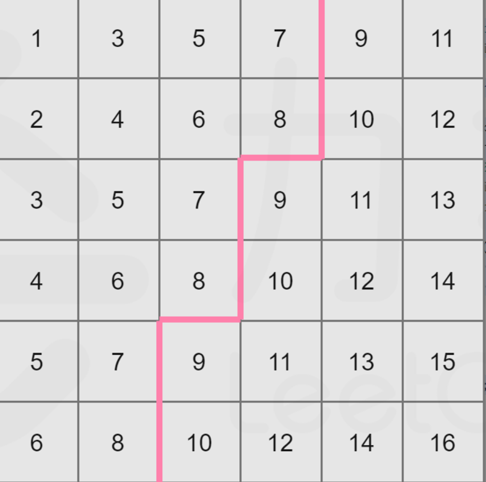

# 378. 有序矩阵中第 K 小的元素（中等）
## 题目：
给你一个 `n x n` 矩阵 `matrix` ，其中每行和每列元素均按升序排序，找到矩阵中第 `k` 小的元素。\
请注意，它是 **排序后** 的第 `k` 小元素，而不是第 `k` 个 **不同** 的元素。\
你必须找到一个内存复杂度优于 `O(n^2)` 的解决方案。
## 题解：
### 方法一：堆
遍历矩阵，始终维护一个最小的k个数的堆，若遍历的数比堆最大的数还小，则更新。\
因为要获取堆中最大的数，因此使用大根堆。
```c++
class Solution {
public:
    int kthSmallest(vector<vector<int>>& matrix, int k) {
        int n=matrix.size();
        if(n==1){
            return matrix[0][0];
        }
        priority_queue<int> q;
        for(int i=0;i<n;i++){
            for(int j=0;j<n;j++){
                if(q.size()<k){
                    q.push(matrix[i][j]);
                }else{
                    if(q.top()>matrix[i][j]){
                        q.pop();
                        q.push(matrix[i][j]);
                    }
                }
            }
        }
        return q.top();
    }
};
```
### 方法二：矩阵性质+二分查找
因为每行每列都递增，因此对于一个数，其左半边的数都比它小，如下图所示。

因此有了递增性质，可以使用折半查找，更新区间的方式就是判断左半区的元素个数与`k`的比较。
```c++
class Solution {
public:
    bool check(vector<vector<int>>& matrix, int mid, int k, int n) {
        int i = n - 1;
        int j = 0;
        int num = 0;
        while (i >= 0 && j < n) {
            if (matrix[i][j] <= mid) {
                num += i + 1;
                j++;
            } else {
                i--;
            }
        }
        return num >= k;
    }

    int kthSmallest(vector<vector<int>>& matrix, int k) {
        int n = matrix.size();
        int left = matrix[0][0];
        int right = matrix[n - 1][n - 1];
        while (left < right) {
            int mid = left + ((right - left) >> 1);
            if (check(matrix, mid, k, n)) {
                right = mid;
            } else {
                left = mid + 1;
            }
        }
        return left;
    }
};
```