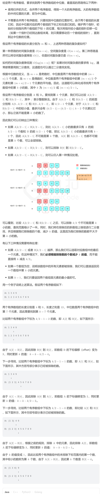

# 4. 寻找两个正序数组的中位数（困难）
## 题目：
1给定两个大小分别为 `m` 和 `n` 的正序（从小到大）数组 `nums1` 和 `nums2`。请你找出并返回这两个正序数组的 **中位数** 。\
算法的时间复杂度应该为 `O(log (m+n))` 。
## 题解：
### 方法一：
因为知道两个数组的长度，因此可以算出中位数的位置。遍历两个数组，获得对应位置的数。
```java
class Solution {
    public double findMedianSortedArrays(int[] nums1, int[] nums2) {
        int m=nums1.length;
        int n=nums2.length;
        int target1, target2;
        if((m+n)%2==1){
            target1=(m+n)/2+1;
            target2=(m+n)/2+1;
        }else{
            target1=(m+n)/2;
            target2=(m+n)/2+1;
        }
        int i=0;
        int j=0;
        double sum=0;
        int cnt=0;
        while(i<m||j<n){
            int temp;
            if(i<m&&j<n){
                if(nums1[i]<nums2[j]){
                    temp=nums1[i];
                    i++;
                }else{
                    temp=nums2[j];
                    j++;
                }
                
            }else if(i==m){
                temp=nums2[j];
                j++;
            }else{
                temp=nums1[i];
                i++;
            }
            cnt++;
            if(cnt==target1){
                sum+=temp;
            }
            if(cnt==target2){
                sum+=temp;
                break;
            }
        }
        return sum/2;

    }
}
```

### 方法二：二分查找

```java
class Solution {
    public int getK(int[] nums1, int[] nums2, int k){
        int m=nums1.length;
        int n=nums2.length;
        int offset1=0;
        int offset2=0;
        while(true){
            if(offset1==m){
                return nums2[offset2+k-1];
            }
            if(offset2==n){
                return nums1[offset1+k-1];
            }
            if(k==1){
                return Math.min(nums1[offset1], nums2[offset2]);
            }
            int half=k/2;
            int index1=Math.min(offset1+half, m)-1;
            int index2=Math.min(offset2+half, n)-1;
            if(nums1[index1]<nums2[index2]){
                k-=(index1-offset1+1);
                offset1=index1+1;
            }else{
                k-=(index2-offset2+1);
                offset2=index2+1;
            }
        }
   }
    public double findMedianSortedArrays(int[] nums1, int[] nums2) {
        int m=nums1.length;
        int n=nums2.length;
        int target1, target2;
        double res;
        if((m+n)%2==1){
            res=getK(nums1, nums2, (m+n)/2+1);
        }else{
            res=(getK(nums1, nums2, (m+n)/2)+getK(nums1, nums2, (m+n)/2+1))/2.0;
        }
        return res;
    }
}
```