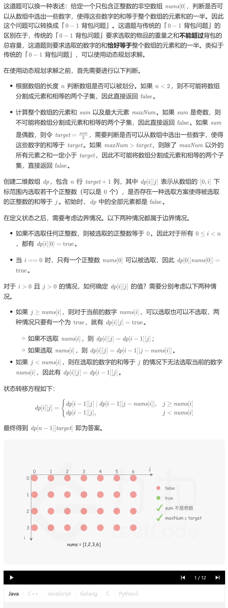

# 416. 分割等和子集（中等）
## 题目：
给你一个 **只包含正整数** 的 **非空** 数组 `nums` 。请你判断是否可以将这个数组分割成两个子集，使得两个子集的元素和相等。
## 题解：

```c++
class Solution {
public:
    bool canPartition(vector<int>& nums) {
        int n=nums.size();
        if(n<2) return false;
        int sum=0;
        int maxNum=nums[0];
        for(int i=0;i<n;i++){
            sum+=nums[i];
            maxNum=max(maxNum, nums[i]);
        }
        if(sum%2) return false;
        int target=sum/2;
        if(maxNum>target) return false;
        vector<vector<int>> dp(n, vector<int>(target+1, 0));
        for(int i=0;i<n;i++){
            dp[i][0]=1;
        }
        dp[0][nums[0]]=1;
        for(int i=1;i<n;i++){
            for(int j=1;j<=target;j++){
                if(nums[i]<=j){
                    dp[i][j]=dp[i-1][j-nums[i]]|dp[i-1][j];
                }else{
                    dp[i][j]=dp[i-1][j];
                }
                
            }
        }
        return dp[n-1][target];
    }
};
```