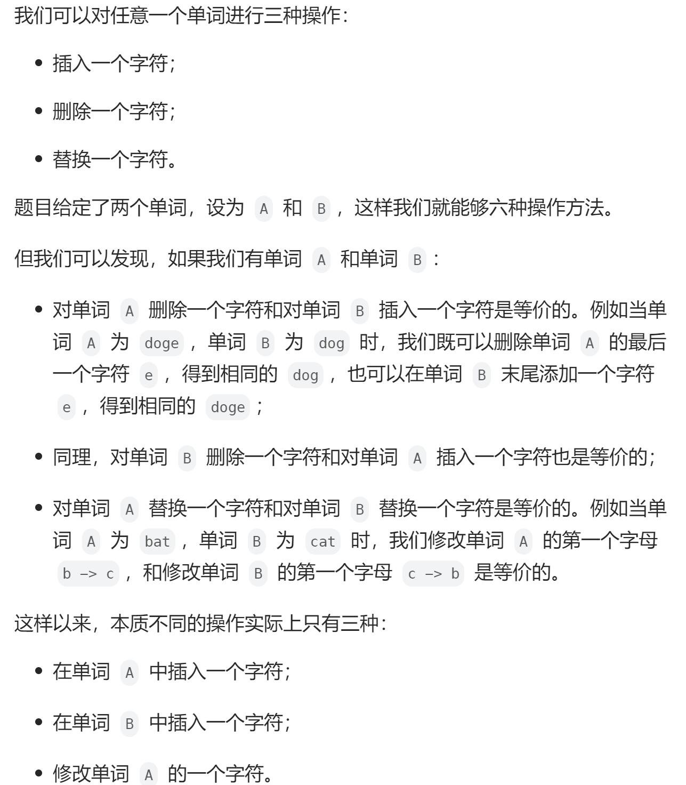

# 72. 编辑距离（困难）
## 题目：
给你两个单词 `word1` 和 `word2`， **请返回将 `word1` 转换成 `word2` 所使用的最少操作数**  。\
你可以对一个单词进行如下三种操作：
* 插入一个字符
* 删除一个字符
* 替换一个字符
## 题解：

令`dp[i][j]`为将`word1[0, i-1]`转化为`word2[0, j-1]`所需的操作数。\
那么显然`dp[i][0]=i`，`dp[0][j]=j`。\
对于`dp[i][j]`，
1. 其可由`dp[i-1][j]`中`word1`删除一个字符得来，即`dp[i-1][j]+1`;
2. 其可由`dp[i][j-1]`中`word2`删除一个字符得来，即`dp[i][j-1]+1`;
3. 其可由`dp[i-1][j-1]`得来，若`word1[i-1]=word2[j-1]`，即`dp[i-1][j-1]`；若`word1[i-1]!=word2[j-1]`，则替换一下，即`dp[i-1][j-1]+1`。

因此`dp[i][j]`三种情况的最小值。
```java
class Solution {
    public int minDistance(String word1, String word2) {
        int m=word1.length();
        int n=word2.length();
        if(n*m == 0){
            return n + m;
        }
        int[][] dp = new int[m + 1][n + 1];
        for(int i = 0; i <= m; i++){
            dp[i][0] = i;
        } 
        for(int i = 0; i <= n; i++){
            dp[0][i] = i;
        }
        for(int i = 1; i <= m; i++){
            for(int j = 1; j <=n ;j++){
                int temp1 = dp[i-1][j] + 1;
                int temp2 = dp[i][j-1] + 1;
                int temp3 = dp[i-1][j-1];
                if(word1.charAt(i-1) != word2.charAt(j-1)){
                    temp3++;
                }
                dp[i][j] = Math.min(temp1, Math.min(temp2, temp3));
            }
        }
        return dp[m][n];
    }
}
```