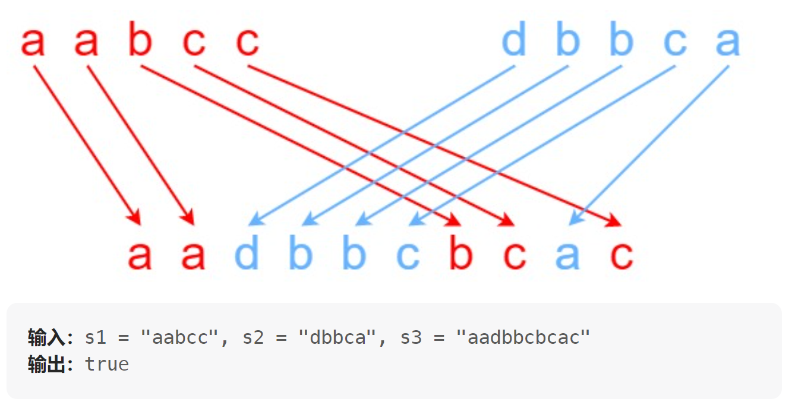

# 97. 交错字符串（中等）
## 题目：
给定三个字符串 `s1`、`s2`、`s3`，请你帮忙验证 `s3` 是否是由 `s1` 和 `s2` **交错** 组成的。\
两个字符串 `s` 和 `t` **交错** 的定义与过程如下，其中每个字符串都会被分割成若干 **非空** 子字符串：
* `s = s_1 + s_2 + ... + s_n`
* `t = t_1 + t_2 + ... + t_m`
* `|n - m| <= 1`
* **交错** 是 `s_1 + t_1 + s_2 + t_2 + s_3 + t_3 + ...` 或者 `t_1 + s_1 + t_2 + s_2 + t_3 + s_3 + ...`

注意：`a + b` 意味着字符串 `a` 和 `b` 连接。

## 题解：
### 方法：动态规划
首先，我想到的是双指针法，拿第一个样例带入就不对，此题可用动态规划。`s1`前`i`个元素和`s2`前`j`个元素能否组成`s3`前`i+j`个元素，令其为`f(i,j)`。那么对于`f(i,j)`，结果要是`true`的话，有两种情况：
1. `s3`第`i+j`个元素等于`s1`第`i`个元素，并且`f(i-1,j)`为真；
2. `s3`第`i+j`个元素等于`s2`第`j`个元素，并且`f(i,j-1)`为真。

即为状态转移方程。初始化`f(0,0)`为`true`。
```c++
class Solution {
public:
    bool isInterleave(string s1, string s2, string s3) {
        int n1=s1.length();
        int n2=s2.length();
        int n3=s3.length();
        if(n3!=(n1+n2)) return false;
        vector<vector<int>> dp(n1+1,vector<int>(n2+1,false));
        dp[0][0]=true;
        for(int i=0;i<=n1;i++){
            for(int j=0;j<=n2;j++){
                int p=i+j-1;
                if(i>0){
                    dp[i][j]|=(dp[i-1][j]&&s3[p]==s1[i-1]);
                }
                if(j>0){
                    dp[i][j]|=(dp[i][j-1]&&s3[p]==s2[j-1]);
                }
            }
        }
        return dp[n1][n2];
    }
};
```
