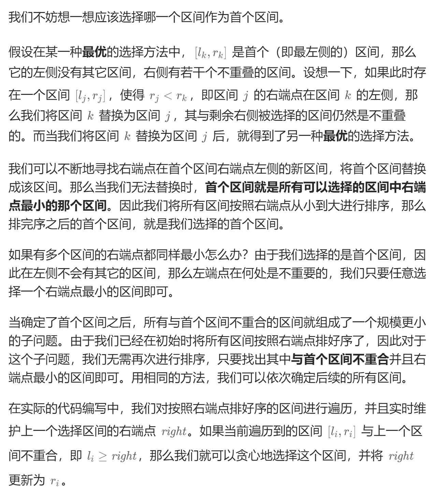

# 435. 无重叠区间
## 题目：
给定一个区间的集合 `intervals` ，其中 `intervals[i] = [start_i, end_i]` 。返回 **需要移除区间的最小数量，使剩余区间互不重叠** 。
## 题解：
要注意题意是互不重叠，没有说明需要连续！


```java
class Solution {
    public int eraseOverlapIntervals(int[][] intervals) {
        int n=intervals.length;
        if(n==0){
            return 0;
        }
        Arrays.sort(intervals, new Comparator<int[]>(){
            @Override
            public int compare(int[] o1, int[] o2){
                return o1[1]-o2[1];
            }
        });
        int right=intervals[0][1];
        int cnt=1;
        for(int i=1;i<n;i++){
            if(intervals[i][0]>=right){
                cnt++;
                right=intervals[i][1];
            }
        }
        return n-cnt;
    }
}
```