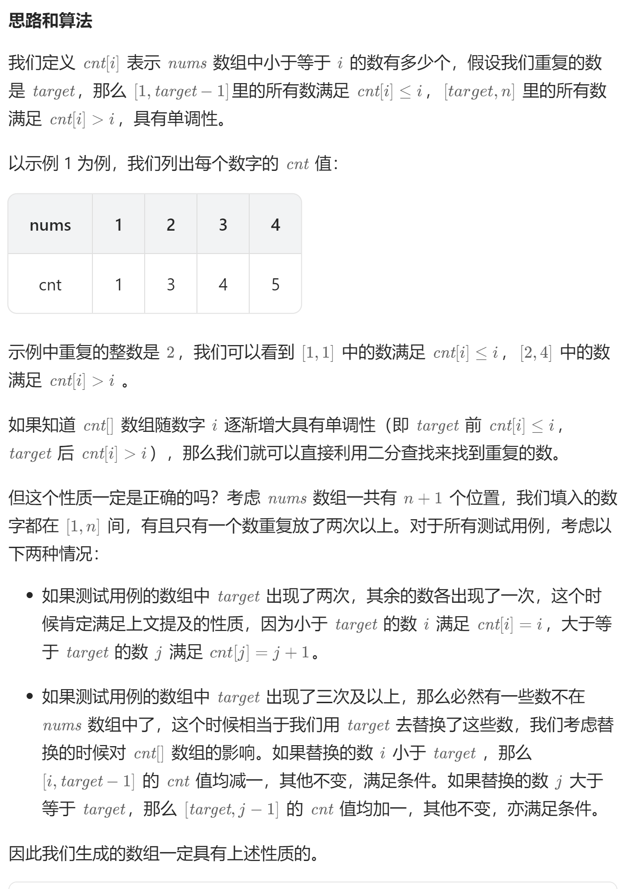

# 287. 寻找重复数（中等）
## 题目：
给定一个包含 `n + 1` 个整数的数组 `nums` ，其数字都在 `[1, n]` 范围内（包括 `1` 和 `n`），可知至少存在一个重复的整数。\
假设 `nums` 只有 一个重复的整数 ，返回 **这个重复的数** 。\
你设计的解决方案必须 **不修改** 数组 `nums` 且只用常量级 `O(1)` 的额外空间。
## 题解：
### 方法：二分查找

```c++
class Solution {
public:
    int findDuplicate(vector<int>& nums) {
        int n=nums.size();
        int left=1;
        int right=n-1;
        int res;
        while(left<=right){
            int mid=(left+right)/2;
            int cnt=0;
            for(int i=0;i<n;i++){
                if(nums[i]<=mid){
                    cnt++;
                }
            }
            if(cnt<=mid){
                left=mid+1;
            }else{
                right=mid-1;
                res=mid;
            }
        }
        return res;
    }
};
```