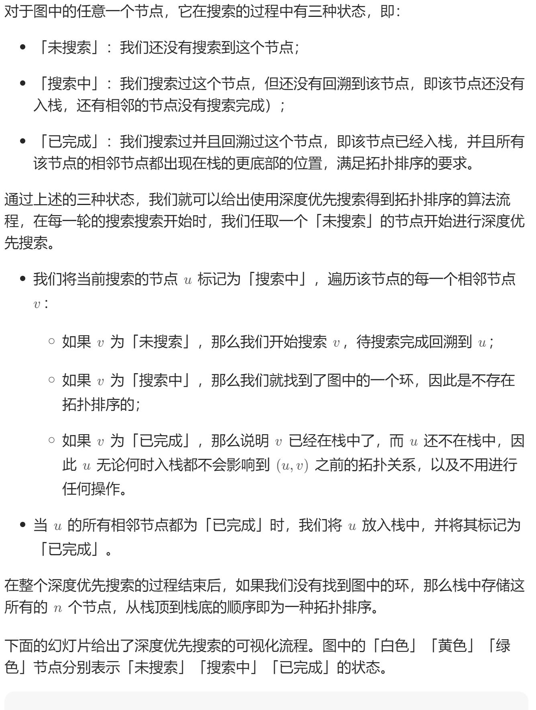

# 207. 课程表（中等）
## 题目：
你这个学期必须选修 `numCourses` 门课程，记为 `0` 到 `numCourses - 1` 。\
在选修某些课程之前需要一些先修课程。 先修课程按数组 `prerequisites` 给出，其中 `prerequisites[i] = [a_i, b_i]` ，表示如果要学习课程 `a_i` 则 必须 先学习课程  `b_i` 。\
例如，先修课程对 `[0, 1]` 表示：想要学习课程 `0` ，你需要先完成课程 `1` 。\
请你判断是否可能完成所有课程的学习？如果可以，返回 `true` ；否则，返回 `false` 。
## 题解：
把每一门课程看作是节点，那么先后关系可以转变为方向，整个课程结构就是有向图结构。\
那么根据题意，我们就是要判断有向图有没有环。\
整体思路是对每个边深度优先遍历，判断有没有环。

```java
class Solution {
    List<List<Integer>> edges;
    int[] visited;
    boolean check=true;

    void dfs(int i){
        visited[i]=1;
        for(int node:edges.get(i)){
            if(visited[node]==0){
                dfs(node);
                if(!check) return;
            }else if(visited[node]==1){
                check=false;
                return;
            }
        }
        visited[i]=2;
    }

    public boolean canFinish(int numCourses, int[][] prerequisites) {
        edges=new ArrayList<List<Integer>>();
        for(int i=0;i<numCourses;i++){
            edges.add(new ArrayList<Integer>());
        }
        visited=new int[numCourses];
        for(int[] temp:prerequisites){
            edges.get(temp[1]).add(temp[0]);
        }
        for(int i=0;i<numCourses&&check;i++){
            if(visited[i]==0){
                dfs(i);
            }
        }
        return check;
    }
}
```