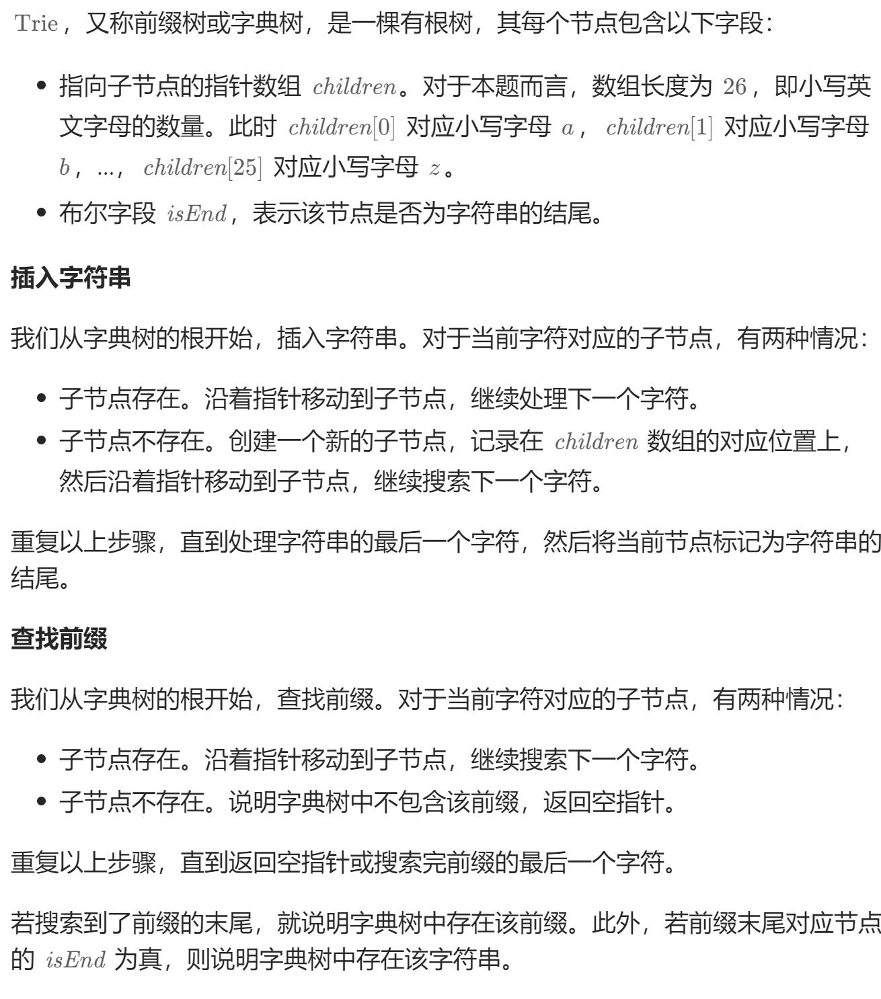

# 208. 实现 Trie (前缀树)（中等）
## 题目：
`Trie`（发音类似 `"try"`）或者说 **前缀树** 是一种树形数据结构，用于高效地存储和检索字符串数据集中的键。这一数据结构有相当多的应用情景，例如自动补完和拼写检查。\
请你实现 `Trie` 类：
* `Trie()` 初始化前缀树对象。
* `void insert(String word)` 向前缀树中插入字符串 `word` 。
* `boolean search(String word)` 如果字符串 `word` 在前缀树中，返回 `true`（即，在检索之前已经插入）；否则，返回 `false` 。
* `boolean startsWith(String prefix)` 如果之前已经插入的字符串 `word` 的前缀之一为 `prefix` ，返回 `true` ；否则，返回 `false` 。
## 题解：
思路类似于有向图，每一个`Trie`对象记录当前字母，和下一个字母的对象指针，相当于一条边。\
如果当前是最后一个字母，则将其标识为末尾。（一条路径上可以有多个末尾，代表不同单词）

```java
class Trie {
    private Trie[] children;
    private boolean end;

    public Trie() {
        children= new Trie[26];
        end=false;
    }
    
    public void insert(String word) {
        Trie node=this;
        for(int i=0;i<word.length();i++){
            char ch=word.charAt(i);
            int temp=ch-'a';
            if(node.children[temp]==null){
                node.children[temp]=new Trie();
            }
            node=node.children[temp];
        }
        node.end=true;
    }
    
    public boolean search(String word) {
        Trie node=this;
        boolean flag=true;
        for(int i=0;i<word.length();i++){
            char ch=word.charAt(i);
            int temp=ch-'a';
            if(node.children[temp]==null){
                flag=false;
                break;
            }else{
                node=node.children[temp];
            }
        }
        return flag&&node.end;
    }
    
    public boolean startsWith(String prefix) {
        Trie node=this;
        for(int i=0;i<prefix.length();i++){
            char ch=prefix.charAt(i);
            int temp=ch-'a';
            if(node.children[temp]==null){
                node=node.children[temp];
                break;
            }else{
                node=node.children[temp];
            }
        }
        return node!=null;
    }
}

/**
 * Your Trie object will be instantiated and called as such:
 * Trie obj = new Trie();
 * obj.insert(word);
 * boolean param_2 = obj.search(word);
 * boolean param_3 = obj.startsWith(prefix);
 */

```
