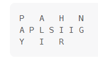

# 6. N 字形变换（中等）
## 题目：
将一个给定字符串 `s` 根据给定的行数 `numRows` ，以从上往下、从左到右进行 `Z` 字形排列。
比如输入字符串为 `"PAYPALISHIRING"` 行数为 `3` 时，排列如下：\
\
之后，你的输出需要从左往右逐行读取，产生出一个新的字符串，比如：`"PAHNAPLSIIGYIR"`。
## 题解：
### 方法：模拟
寻找一行字符的下标关系。下标关系，可以分为两类：
1. 头尾两行：下标递增`numRows+numRows-2`；
2. 中间若干行：多了斜杠部分的字符，可以发现斜杠部分，一行固定两个字符，因此可以计算多少行`r`，递增`1+r*2+1`。
```c++
class Solution {
public:
    string convert(string s, int numRows) {
        string res;
        int n=s.length();
        if(n<=2) return s;
        if(numRows==1) return s;
        for(int i=0;i<numRows;i++){
            int j=i;
            while(j<n){
                res.push_back(s[j]);
                if(i==0||i==numRows-1) j+=numRows+numRows-2;
                else{
                    if(j%(numRows+numRows-2)<numRows-1) j+=1+((numRows-2)-i)*2+1;
                    else j+=1+(i-1)*2+1;
                }
            }
        }
        return res;
    }
};
```