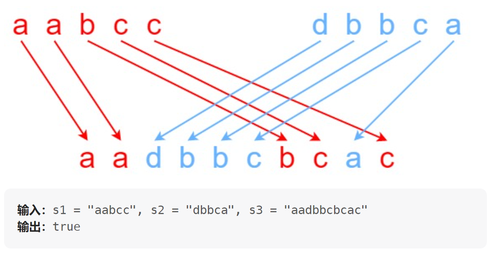

# 97. 交错字符串（中等）
## 题目：
给定三个字符串 `s1`、`s2`、`s3`，请你帮忙验证 `s3` 是否是由 `s1` 和 `s2` **交错** 组成的。\
两个字符串 `s` 和 `t` **交错** 的定义与过程如下，其中每个字符串都会被分割成若干 **非空** 子字符串：
* `s = s_1 + s_2 + ... + s_n`
* `t = t_1 + t_2 + ... + t_m`
* `|n - m| <= 1`
* **交错** 是 `s_1 + t_1 + s_2 + t_2 + s_3 + t_3 + ...` 或者 `t_1 + s_1 + t_2 + s_2 + t_3 + s_3 + ...`

注意：`a + b` 意味着字符串 `a` 和 `b` 连接。

## 题解：
### 方法：动态规划

