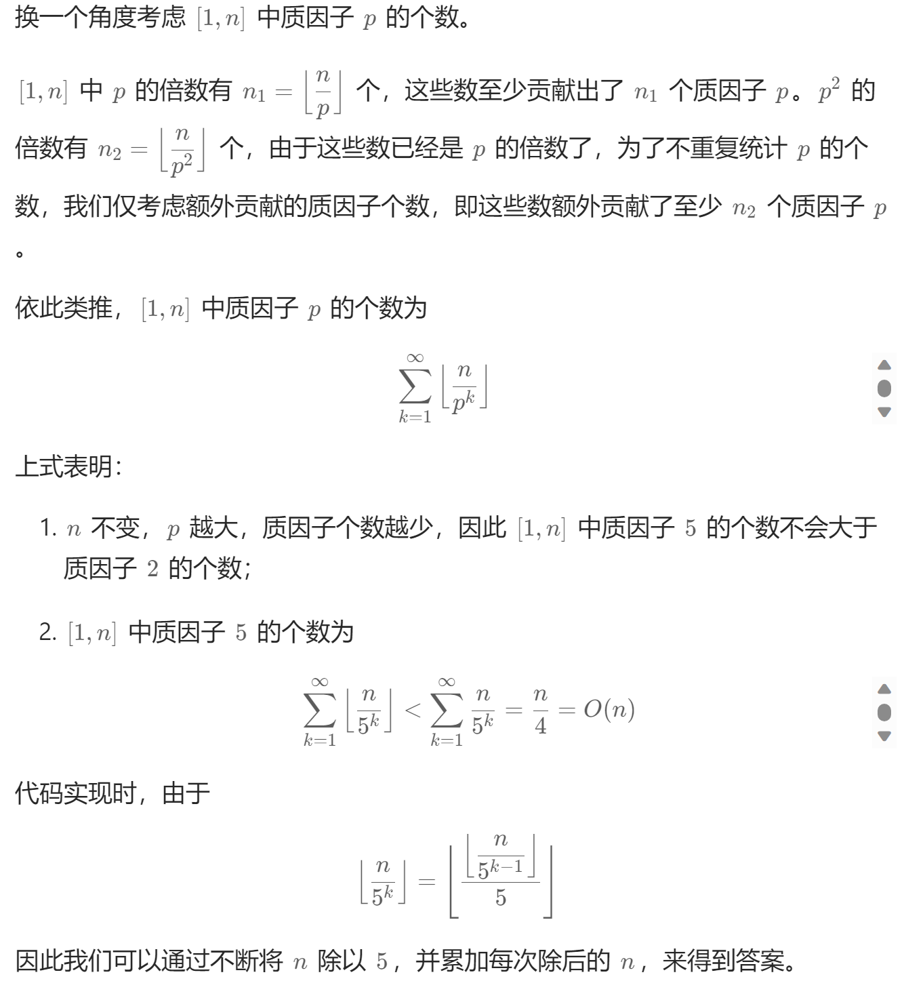

# 172. 阶乘后的零（中等）
## 题目：
给定一个整数 `n` ，返回 `n!` 结果中尾随零的数量。\
提示 `n! = n * (n - 1) * (n - 2) * ... * 3 * 2 * 1`
## 题解：
尾随零只有可能来源于`2*5`，因此找到`[1,n]`中因子`2`和因子`5`数量的最小值即可。\
因子`5`的数量不会大于因子`2`的数量，因此寻找因子`5`的数量即可，证明如下。

以`130`为例：
* 第一次除以`5`时得到`26`，表明存在`26`个包含 `1` 个因数`5`的数；
* 第二次除以`5`得到`5`，表明存在`5`个包含 `2` 个因数`5`的数(这些数字的一个因数`5`已经在第一次运算的时候统计了)；
* 第三次除以`5`得到`1`，表明存在`1`个包含 `3` 个因数`5`的数(这些数字的两个因数`5`已经在前两次运算的时候统计了)；
* 得到从`[1, 130]`中所有`5`的因数的个数

```c++
class Solution {
public:
    int trailingZeroes(int n) {
        int res=0;
        while(n){
            n/=5;
            res+=n;
        }
        return res;
    }
};
```