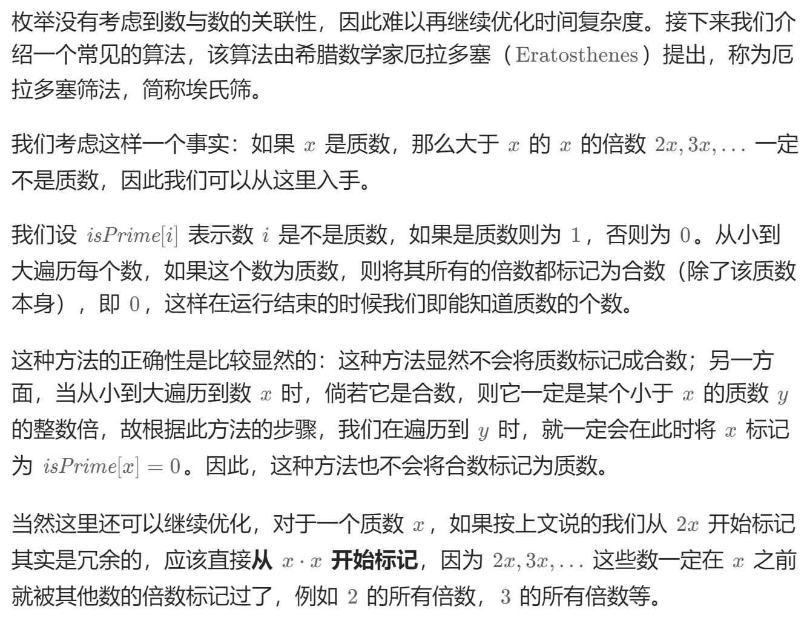

# 204. 计数质数（中等）
## 题目：
给定整数 `n` ，返回 **所有小于非负整数** `n` 的质数的数量 。
## 题解：
### 方法一：暴力+优化
判断`y`是否是质数，暴力方法是遍历`[2, y-1]`。\
然而，假如`x`是因数，那么`y/x`也是因数，因此只用判断`min(x,y/x)`即可，不用重复判断。\
易知，较小的那个一定落在`[2,根号x]`区间，只要遍历这个区间即可。
```c++
class Solution {
public:
    int prime(int num){
        for(int i=2;i*i<=num;i++){
            if(num%i==0){
                return false;
            }
        }
        return true;
    }
    int countPrimes(int n) {
        int res=0;
        for(int i=2;i<n;i++){
            res+=prime(i);
        }
        return res;
    }
};
```
### 方法二：埃氏筛

```c++
class Solution {
public:
    int countPrimes(int n) {
        vector<int> prime(n,1);
        int res=0;
        for(int i=2;i<n;i++){
            if(prime[i]){
                res++;
                if((long long)i*i<n){
                    for(int j=i*i;j<n;j+=i){
                        prime[j]=0;
                    }
                }
            }
        }
        return res;
    }
};
```