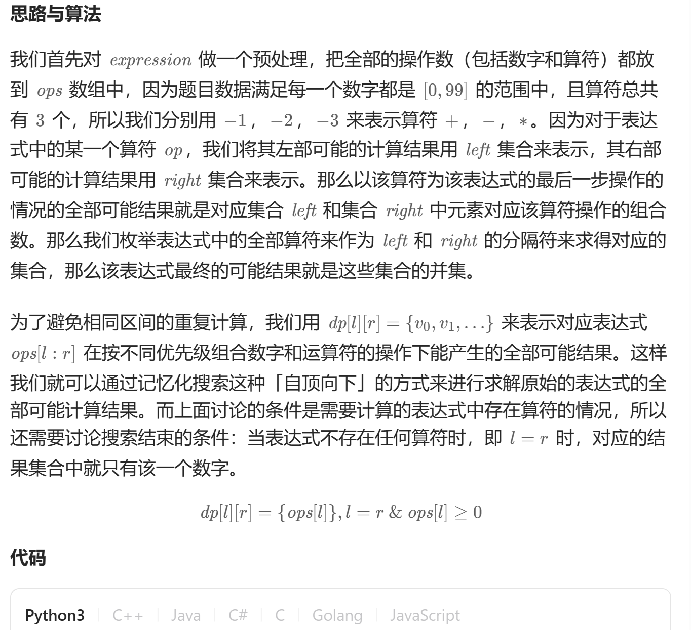

# 241. 为运算表达式设计优先级（中等）
## 题目：
给你一个由数字和运算符组成的字符串 `expression` ，按不同优先级组合数字和运算符，计算并返回所有可能组合的结果。你可以 **按任意顺序** 返回答案。\
生成的测试用例满足其对应输出值符合 `32` 位整数范围，不同结果的数量不超过 `10^4` 。
## 题解：

```c++
class Solution {
public:
    const int ADD = -1;
    const int SUB = -2;
    const int MULTI = -3;
    vector<int> dfs(vector<vector<vector<int>>>& dp, int l, int r, vector<int>& ops) {
        if (dp[l][r].empty()) {
            if (l == r) {
                dp[l][r].emplace_back(ops[l]);
            }
            else {
                for (int i = l; i < r; i += 2) {
                    vector<int> left = dfs(dp, l, i, ops);
                    vector<int> right = dfs(dp, i + 2, r, ops);
                    for (int j = 0; j < left.size(); j++) {
                        for (int k = 0; k < right.size(); k++) {
                            if (ops[i + 1] == ADD) {
                                dp[l][r].emplace_back(left[j] + right[k]);
                            }
                            else if (ops[i + 1] == SUB) {
                                dp[l][r].emplace_back(left[j] - right[k]);
                            }
                            else {
                                dp[l][r].emplace_back(left[j] * right[k]);
                            }
                        }
                    }
                }
            }
        }
        return dp[l][r];
    }

    vector<int> diffWaysToCompute(string expression) {
        vector<int> ops;
        int i = 0;
        int n = expression.size();
        while (i < n) {
            if (isdigit(expression[i])) {
                int sum = 0;
                while (i < n && isdigit(expression[i])) {
                    sum = sum * 10 + expression[i] - '0';
                    i++;
                }
                ops.emplace_back(sum);
            }
            else {
                if (expression[i] == '+') {
                    ops.emplace_back(ADD);
                }
                else if (expression[i] == '-') {
                    ops.emplace_back(SUB);
                }
                else {
                    ops.emplace_back(MULTI);
                }
                i++;
            }
        }
        vector<vector<vector<int>>> dp((int)ops.size(), vector<vector<int>>((int)ops.size()));
        return dfs(dp, 0, ops.size() - 1, ops);
    }
};
```