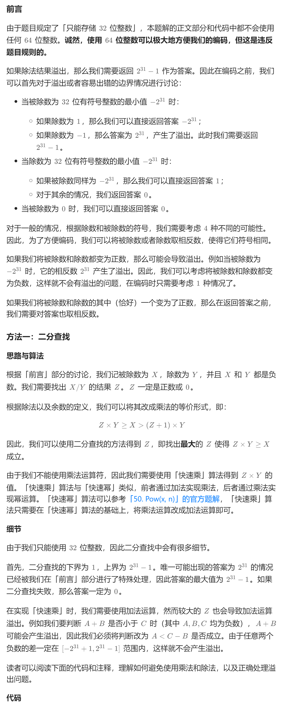

# 29. 两数相除（中等）
## 题目：
给你两个整数，被除数 `dividend` 和除数 `divisor`。将两数相除，要求 **不使用** 乘法、除法和取余运算。\
整数除法应该向零截断，也就是截去（`truncate`）其小数部分。例如，`8.345` 将被截断为 `8` ，`-2.7335` 将被截断至 `-2` 。\
返回被除数 `dividend` 除以除数 `divisor` 得到的 **商** 。\
注意：假设我们的环境只能存储 `32` **位** 有符号整数，其数值范围是 `[−2^31,  2^31 − 1]` 。本题中，如果商 **严格大于** `2^31 − 1` ，则返回 `2^31 − 1` ；如果商 **严格小于** `-2^31` ，则返回 `-2^31` 。
## 题解：

其中快速加法类似于快速幂（50题），使用迭代的话，本质上是将`z`写成二进制格式，将其中`1`的位数对应的数值加到结果。
```c++
class Solution {
public:
    bool quickAdd(int dividend, int divisor, int quotient){
        int sum=0;
        int add=divisor;
        while(quotient){
            if(quotient&1){
                if(sum<dividend-add){
                    return false;
                }
                sum+=add;
            }
            if(quotient!=1){
                if(add<dividend-add){
                    return false;
                }
                add+=add;
            }
            quotient>>=1;
        }
        return true;
    }
    int divide(int dividend, int divisor) {
        if(dividend==INT_MIN){
            if(divisor==1) return INT_MIN;
            if(divisor==-1) return INT_MAX;
        }
        if(divisor==INT_MIN){
            if(dividend==INT_MIN) return 1;
            else return 0;
        }
        if(dividend==0) return 0;
        bool flag=false;
        if(dividend>0){
            dividend=-dividend;
            flag=!flag;
        }
        if(divisor>0){
            divisor=-divisor;
            flag=!flag;
        }
        int left=1;
        int right=INT_MAX;
        int res=0;
        while(left<=right){
            int mid=left+((right-left)>>1);
            bool check=quickAdd(dividend,divisor,mid);
            if(check){
                res=mid;
                if(mid==INT_MAX){
                    break;
                }
                left=mid+1;
            }else{
                right=mid-1;
            }
        }
        return flag?-res:res;
    }
};
```
