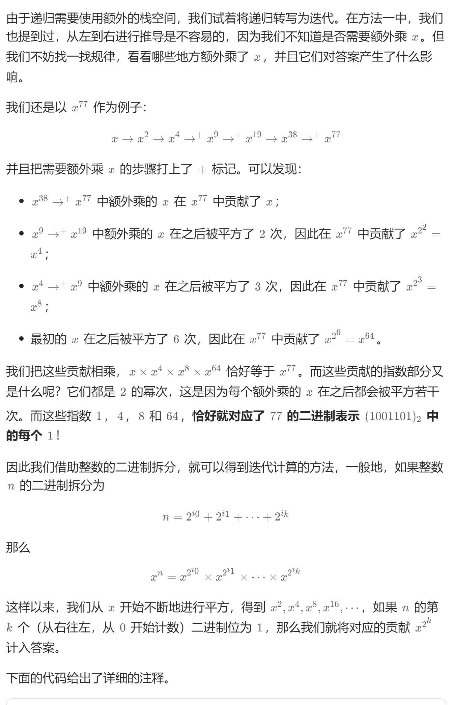

# 50. Pow(x, n)（中等）
## 题目：
实现 `pow(x, n)` ，即计算 `x` 的整数 `n` 次幂函数（即，`x^n` ）。
## 题解：
n表示为二进制，将1对应位数的结果乘入结果。

```c++
class Solution {
public:
    double myPow(double x, int n) {
        double res=1;
        double temp=x;
        bool flag=false;
        long long n1=n;
        if(n1<0){
            flag=true;
            n1=-n1;
        }
        while(n1>0){
            if(n1&1){
                res*=temp;
            }
            temp=temp*temp;
            n1=n1/2;
        }
        if(flag){
            res=1/res;
        }
        return res;
    }
};
```