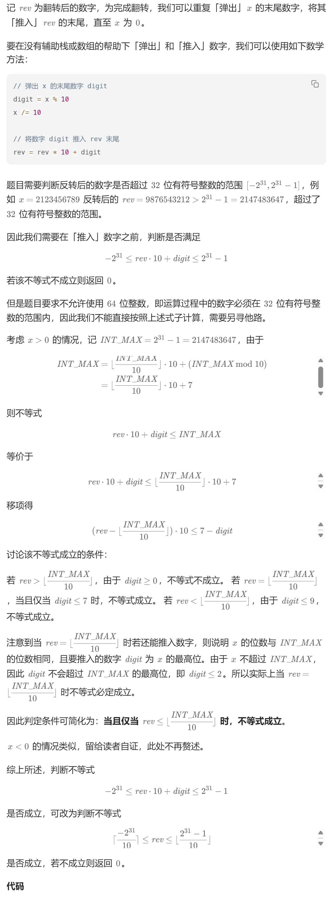

# 7. 整数反转（中等）
## 题目：
给你一个 `32` 位的有符号整数 `x` ，返回将 `x` 中的数字部分反转后的结果。\
如果反转后整数超过 `32` 位的有符号整数的范围 `[−2^31,  2^31 − 1]` ，就返回 `0`。\
假设环境不允许存储 `64` 位整数（有符号或无符号）。
## 题解：
这题主要难在要判断是否超过32位，但是又不给使用64位变量。因此需要通过数学推导来判断。

```c++
class Solution {
public:
    int reverse(int x) {
        int res=0;
        while(x){
            if(res<INT_MIN/10||res>INT_MAX/10) return 0;
            res=res*10+x%10;
            x=x/10;
        }
        return res;
    }
};
```