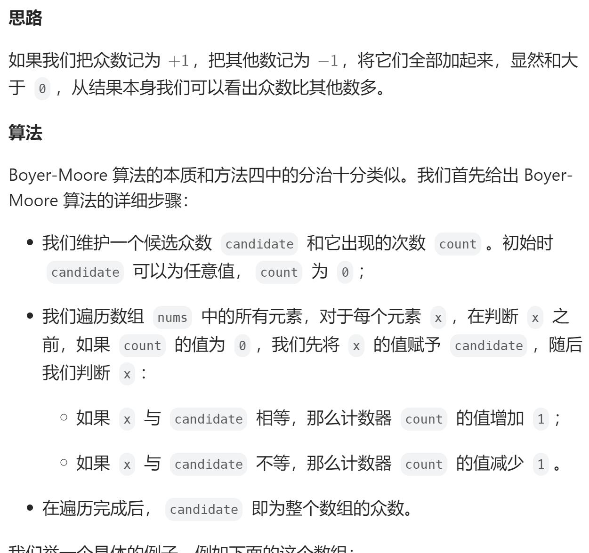

# 169. 多数元素（简单）
## 题目：
给定一个大小为 `n` 的数组 `nums` ，返回其中的多数元素。多数元素是指在数组中出现次数 **大于** `⌊ n/2 ⌋` 的元素。\
你可以假设数组是非空的，并且给定的数组总是存在多数元素。
## 题解：
### 方法一：哈希表
哈希表记录数字出现次数
```java
class Solution {
    public int majorityElement(int[] nums) {
        int n=nums.length;
        Map<Integer, Integer> map=new HashMap<>();
        for(int i=0;i<n;i++){
            if(map.containsKey(nums[i])){
                map.put(nums[i], map.get(nums[i])+1);
            }else{
                map.put(nums[i],1);
            }
        }
        int res=Integer.MIN_VALUE;
        for(int key:map.keySet()){
            if(map.get(key)>n/2){
                res=key;
                break;
            }
        }
        return res;
    }
}
```
### 方法二：Boyer-Moore 投票算法

```java
class Solution {
    public int majorityElement(int[] nums) {
        int n=nums.length;
        int cnt=0;
        int res=Integer.MIN_VALUE;
        for(int i=0;i<n;i++){
            if(cnt==0){
                res=nums[i];
            }
            cnt+=nums[i]==res?1:-1;
        }
        return res;
    }
}
```