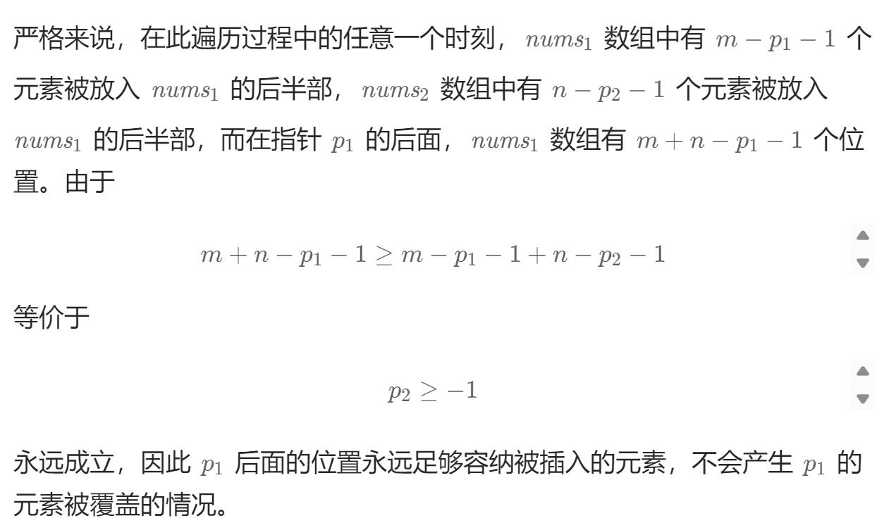

# 88. 合并两个有序数组（简单）
## 题目：
给你两个按 **非递减顺序** 排列的整数数组 `nums1` 和 `nums2`，另有两个整数 `m` 和 `n` ，分别表示 `nums1` 和 `nums2` 中的元素数目。\
请你 **合并** `nums2` 到 `nums1` 中，使合并后的数组同样按 **非递减顺序** 排列。\
注意：最终，合并后数组不应由函数返回，而是存储在数组 `nums1` 中。为了应对这种情况，`nums1` 的初始长度为 `m + n`，其中前 `m` 个元素表示应合并的元素，后 `n` 个元素为 `0` ，应忽略。`nums2` 的长度为 `n` 。
## 题解：
### 方法一：头插法
将nums2数组元素挨个插入到nums1中。\
使用双指针记录插入的位置和nums2元素。
```java
class Solution {
    public void merge(int[] nums1, int m, int[] nums2, int n) {
        if(n==0) return;
        int j=0;
        int i=0;
        while(j<n){
            while(i<m+j&&nums2[j]>nums1[i]){
                i++;
            }
            for(int k=m+n-1;k>i;k--){
                nums1[k]=nums1[k-1];
            }
            nums1[i]=nums2[j];
            j++;
            i++;
        }
    }
}
```
### 方法二：尾插法
由题意可知，`nums1`数组尾部预留了一部分空间放置`nums2`数组。\
因此尾部预留空间不用担心元素覆盖问题，本题可以从尾部开始放置较大的元素。\
因为最终要遍历完整个`nums1`数组，所以当用完预留空间后会有覆盖问题吗？不会。\

```java
class Solution {
    public void merge(int[] nums1, int m, int[] nums2, int n) {
        int p1=m-1;
        int p2=n-1;
        int tail=m+n-1;
        int cur;
        while(p1>=0||p2>=0){
            if(p1==-1){
                cur=nums2[p2--];
            }else if(p2==-1){
                cur=nums1[p1--];
            }else if(nums1[p1]>nums2[p2]){
                cur=nums1[p1--];
            }else{
                cur=nums2[p2--];
            }
            nums1[tail--]=cur;
        }
    }
}

```
