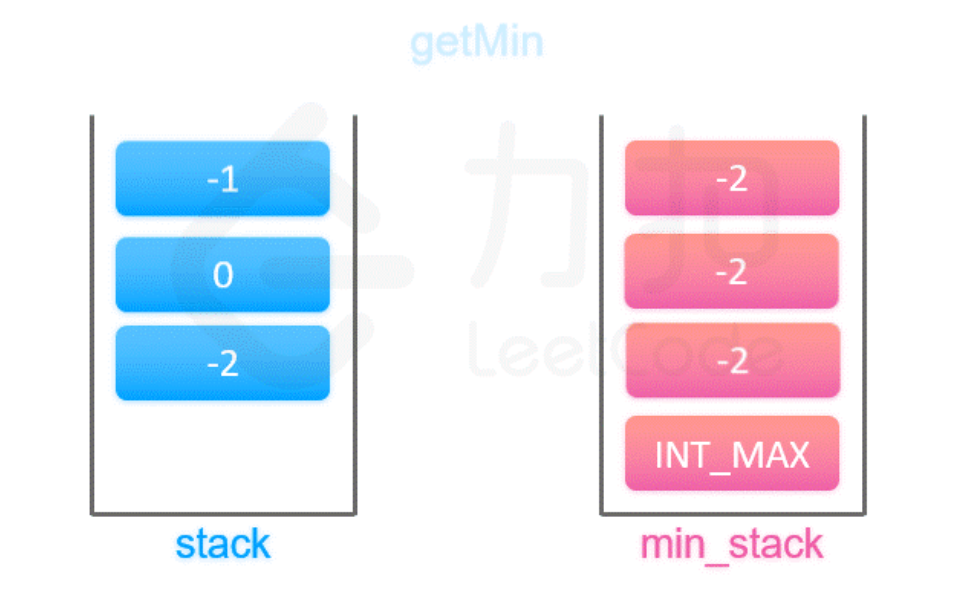

# 155. 最小栈（中等）
## 题目：
设计一个支持 `push` ，`pop` ，`top` 操作，并能在常数时间内检索到最小元素的栈。\
实现 `MinStack` 类:
* `MinStack()` 初始化堆栈对象。
* `void push(int val)` 将元素`val`推入堆栈。
* `void pop()` 删除堆栈顶部的元素。
* `int top()` 获取堆栈顶部的元素。
* `int getMin()` 获取堆栈中的最小元素。

## 题解：
难度主要是在常数时间求最小值。\
维护一个最小值的栈：普通栈每加一个元素，最小栈也加入对应的栈的最小值（加入的数值与之前栈的最小值比较）。

```c++
class MinStack {
private:
    stack<int> vals;
    stack<int> minVal;
public:
    MinStack() {
        minVal.push(INT_MAX);
    }
    
    void push(int val) {
        vals.push(val);
        minVal.push(min(minVal.top(),val));
    }
    
    void pop() {
        vals.pop();
        minVal.pop();
    }
    
    int top() {
        return vals.top();
    }
    
    int getMin() {
        return minVal.top();
    }
};

/**
 * Your MinStack object will be instantiated and called as such:
 * MinStack* obj = new MinStack();
 * obj->push(val);
 * obj->pop();
 * int param_3 = obj->top();
 * int param_4 = obj->getMin();
 */
```
```java
class MinStack {
    Deque<Long> stack;
    long minVal;

    public MinStack() {
        stack=new ArrayDeque<>();
        minVal=Integer.MAX_VALUE;
    }
    
    public void push(int val) {
        if(stack.isEmpty()){
            stack.push(0L);
            minVal=val;
        }else{
            stack.push((long)val-minVal);
            minVal=Math.min(val, minVal);
        }
    }
    
    public void pop() {
        long val=stack.pop();
        if(val<0){
            minVal=minVal-val;
        }
    }
    
    public int top() {
        long val=stack.peek();
        if(val<0) return (int)minVal;
        else{
            return (int)(minVal+val);
        }
    }
    
    public int getMin() {
        return (int)minVal;
    }
}

/**
 * Your MinStack object will be instantiated and called as such:
 * MinStack obj = new MinStack();
 * obj.push(val);
 * obj.pop();
 * int param_3 = obj.top();
 * int param_4 = obj.getMin();
 */
```
### 方法：存储差值
这个方法只需要使用一个栈，栈中存储的是元素与当前最小值的差值。

当栈为空时，最小值就是当前元素，栈中放入`0`；不为空，则放入元素与当前最小值的差值，然后更新最小值（如果先更新最小值，再放入差值，则无法找到上一个最小值）。

这样当`pop`时，栈顶元素小于`0`，我们就知道`pop`的是最小值，需要更新最小值。

获取栈顶元素时，就判断栈顶元素是否小于`0`，是则返回最小值，否则返回最小值与差值的和。