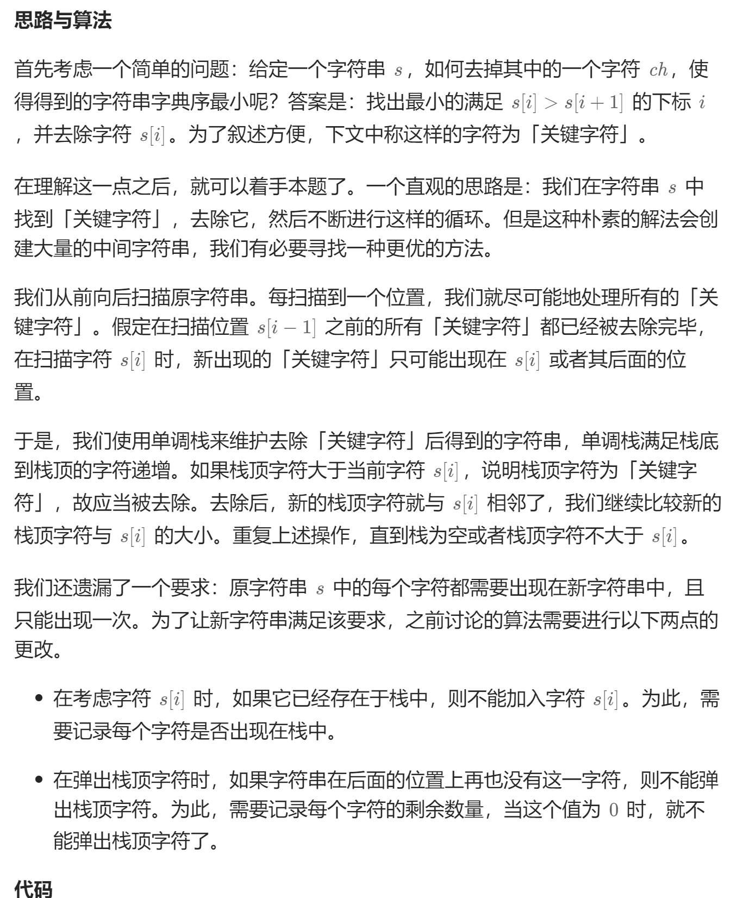

# 316. 去除重复字母（中等）
## 题目：
给你一个字符串 `s` ，请你去除字符串中重复的字母，使得每个字母只出现一次。需保证 **返回结果的字典序最小**（要求不能打乱其他字符的相对位置）。
## 题解：
### 方法：贪心+单调栈

```c++
class Solution {
public:
    string removeDuplicateLetters(string s) {
        vector<int> cnt(26);
        int n=s.size();
        for(int i=0;i<n;i++){
            cnt[s[i]-'a']++;
        }
        vector<int> vis(26);
        string res;
        for(int i=0;i<n;i++){
            if(vis[s[i]-'a']==0){
                while(!res.empty()&&res.back()>s[i]){
                    if(cnt[res.back()-'a']>0){
                        vis[res.back()-'a']=0;
                        res.pop_back();
                    }else{
                        break;
                    }
                }
                vis[s[i]-'a']=1;
                res.push_back(s[i]);
            }
            cnt[s[i]-'a']-=1;
        }
        return res;
    }
};
```