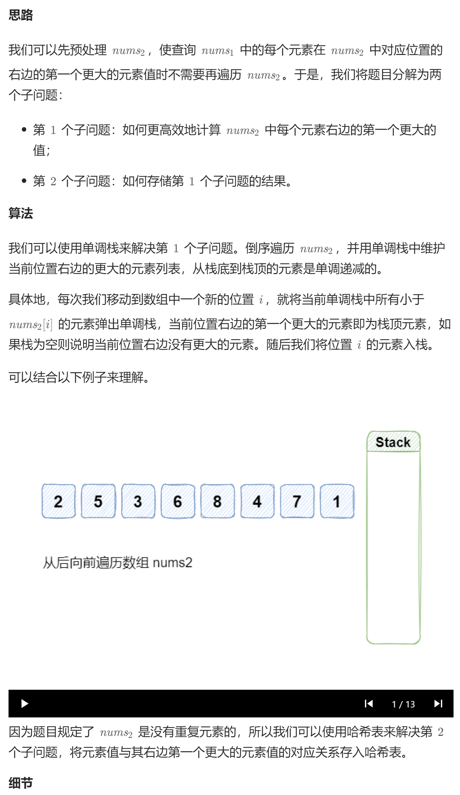

# 496. 下一个更大元素 I（简单）
## 题目：
`nums1` 中数字 `x` 的 **下一个更大元素** 是指 `x` 在 `nums2` 中对应位置 **右侧** 的 **第一个** 比 `x` 大的元素。\
给你两个 **没有重复元素** 的数组 `nums1` 和 `nums2` ，下标从 `0` 开始计数，其中`nums1` 是 `nums2` 的子集。\
对于每个 `0 <= i < nums1.length` ，找出满足 `nums1[i] == nums2[j]` 的下标 `j` ，并且在 `nums2` 确定 `nums2[j]` 的 **下一个更大元素** 。如果不存在下一个更大元素，那么本次查询的答案是 `-1` 。\
返回一个长度为 `nums1.length` 的数组 `ans` 作为答案，满足 `ans[i]` 是如上所述的 **下一个更大元素** 。
## 题解：
因为是寻找**下一个**，所以从右开始遍历。

```c++
class Solution {
public:
    vector<int> nextGreaterElement(vector<int>& nums1, vector<int>& nums2) {
        map<int,int> bigger;
        stack<int> temp;
        vector<int> res;
        int n2=nums2.size();
        for(int i=n2-1;i>=0;i--){
            while(!temp.empty()&&temp.top()<=nums2[i]){
                temp.pop();
            }
            bigger[nums2[i]]=temp.empty()?-1:temp.top();
            temp.push(nums2[i]);
        }
        int n1=nums1.size();
        for(int i=0;i<n1;i++){
            res.emplace_back(bigger[nums1[i]]);
        }
        return res;
    }
};
```