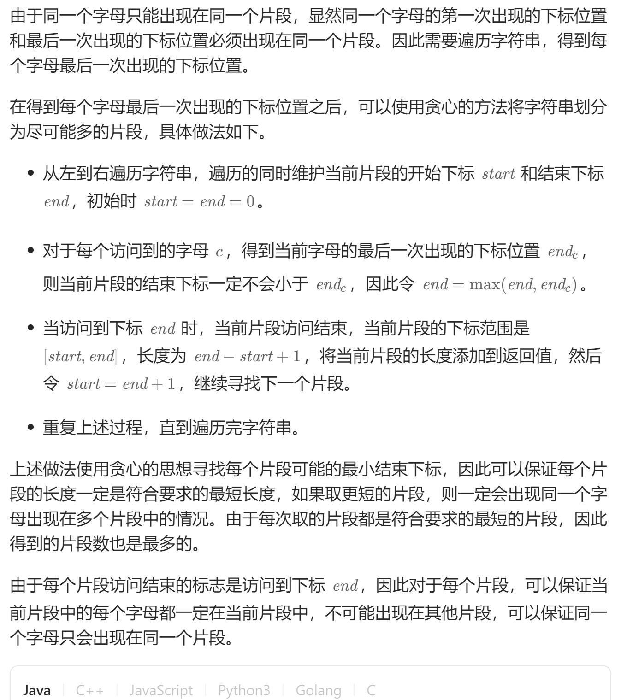

# 763. 划分字母区间（中等）
## 题目：
给你一个字符串 `s` 。我们要把这个字符串划分为尽可能多的片段，同一字母最多出现在一个片段中。\
注意，划分结果需要满足：将所有划分结果按顺序连接，得到的字符串仍然是`s`。\
返回一个表示每个字符串片段的长度的列表。
## 题解：

```c++
class Solution {
public:
    vector<int> partitionLabels(string s) {
        vector<int> mp(26);
        int n=s.length();
        for(int i=0;i<n;i++){
            mp[s[i]-'a']=i;
        }
        vector<int> res;
        int start=0;
        int end=0;
        for(int i=0;i<n;i++){
            end=max(end,mp[s[i]-'a']);
            if(i==end){
                res.emplace_back(end-start+1);
                start=i+1;
                end=i+1;
            }
        }
        return res;
    }
};
```
