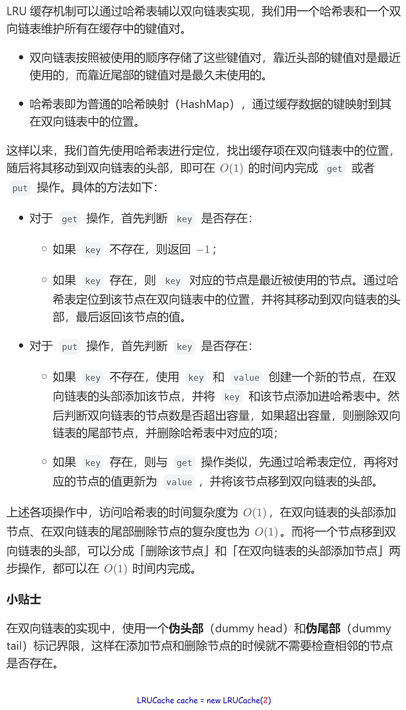

# 146. LRU 缓存（中等）
## 题目：
请你设计并实现一个满足  `LRU` **(最近最少使用) 缓存** 约束的数据结构。\
实现 `LRUCache` 类：
* `LRUCache(int capacity)` 以 **正整数** 作为容量 `capacity` 初始化 `LRU` 缓存
* `int get(int key)` 如果关键字 `key` 存在于缓存中，则返回关键字的值，否则返回 `-1` 。
* `void put(int key, int value)` 如果关键字 `key` 已经存在，则变更其数据值 `value` ；如果不存在，则向缓存中插入该组 `key-value` 。如果插入操作导致关键字数量超过 `capacity` ，则应该 **逐出** 最久未使用的关键字。

函数 `get` 和 `put` 必须以 `O(1)` 的平均时间复杂度运行。
## 题解：
### 方法：双向链表+哈希表
为了以O(1)的时间复杂度进行增删，可以使用双向链表；O(1)的时间复杂度进行查找，可以使用哈希表，键值为key，值为链表节点。\
因为涉及到删除操作，所以总是判断节点前后有无节点是很麻烦的，可以使用dummyHead和dummyTail，确保链表一直有节点。\

```java
class LRUCache {
    class DLinkedNode{
        int key;
        int value;
        DLinkedNode prev;
        DLinkedNode next;
        public DLinkedNode(){};
        public DLinkedNode(int k, int v){
            key=k;
            value=v;
        }
    }

    private Map<Integer, DLinkedNode> cache=new HashMap<>();
    private int size;
    private int capacity;
    private DLinkedNode head;
    private DLinkedNode tail;

    public LRUCache(int capacity) {
        this.size=0;
        this.capacity=capacity;
        head=new DLinkedNode();
        tail=new DLinkedNode();
        head.next=tail;
        tail.prev=head;
    }
    
    public int get(int key) {
        DLinkedNode node=cache.get(key);
        if(node==null) return -1;
        else{
            moveToHead(node);
            return node.value;
        }
    }
    
    public void put(int key, int value) {
        DLinkedNode node=cache.get(key);
        if(node==null){
            DLinkedNode newNode=new DLinkedNode(key, value);
            cache.put(key, newNode);
            addToHead(newNode);
            size++;
            if(size>capacity){
                removeNode(tail.prev);
                size--;
            }
        }else{
            node.value=value;
            moveToHead(node);
        }
    }

    public void moveToHead(DLinkedNode node){
        removeNode(node);
        cache.put(node.key, node);
        addToHead(node);
    }

    public void removeNode(DLinkedNode node){
        cache.remove(node.key);
        node.next.prev=node.prev;
        node.prev.next=node.next;
        node.next=null;
        node.prev=null;
    }

    public void addToHead(DLinkedNode node){
        node.prev=head;
        node.next=head.next;
        head.next=node;
        node.next.prev=node;
    }
}

/**
 * Your LRUCache object will be instantiated and called as such:
 * LRUCache obj = new LRUCache(capacity);
 * int param_1 = obj.get(key);
 * obj.put(key,value);
 */
```
```java
class LRUCache {
    class DLinkedNode{
        private int val;
        private int key;
        private DLinkedNode pre;
        private DLinkedNode next;
        
        public DLinkedNode(int key, int val){
            this.val=val;
            this.key=key;
        }
    }

    private int cnt=0;
    private int size;
    private DLinkedNode head;
    private DLinkedNode tail;
    private Map<Integer, DLinkedNode> map;

    public LRUCache(int capacity) {
        size=capacity;
        head=new DLinkedNode(-1, 0);
        tail=new DLinkedNode(-1, 0);
        head.next=tail;
        tail.pre=head;
        map=new HashMap<>();
    }
    
    public int get(int key) {
        int res=-1;
        if(map.containsKey(key)){
            DLinkedNode cur=map.get(key);
            res=cur.val;
            remove(cur);
            addLast(cur);
        }
        return res;
    }
    
    public void put(int key, int value) {
        if(map.containsKey(key)){
            DLinkedNode cur=map.get(key);
            cur.val=value;
            remove(cur);
            addLast(cur);
        }else{
            DLinkedNode cur=new DLinkedNode(key, value);
            if(cnt<size){
                addLast(cur);
                cnt++;
            }else{
                DLinkedNode temp=head.next;
                remove(temp);
                map.remove(temp.key);
                addLast(cur);
            }
            map.put(key, cur);
        }
    }

    public void remove(DLinkedNode node){
        node.pre.next=node.next;
        node.next.pre=node.pre;
        node.pre=null;
        node.next=null;
    }

    public void addLast(DLinkedNode node){
        tail.pre.next=node;
        node.pre=tail.pre;
        tail.pre=node;
        node.next=tail;
    }
}

/**
 * Your LRUCache object will be instantiated and called as such:
 * LRUCache obj = new LRUCache(capacity);
 * int param_1 = obj.get(key);
 * obj.put(key,value);
 */
```
